# AI-FitAdvisor 💪🤖

<p align="center">
  <em>A scalable, microservices-based fitness platform offering AI-driven workout recommendations and comprehensive activity tracking.</em>
</p>

<p align="center">
  <a href="https://github.com/baidya-ripan-024/AI-FitAdvisor/stargazers"></a>
  <a href="https://github.com/baidya-ripan-024/AI-FitAdvisor/network/members"></a>
  <a href="https://github.com/baidya-ripan-024/AI-FitAdvisor/issues"></a>
  <a href="https://github.com/baidya-ripan-024/AI-FitAdvisor/blob/main/LICENSE"></a>
</p>

## ✨ About The Project

AI-FitAdvisor is not just another fitness tracker. It's a smart, personalized fitness companion designed to help users achieve their health goals effectively. By leveraging the power of Generative AI, this platform provides tailored workout plans and dietary suggestions that adapt to the user's progress and preferences in real-time.

Built on a robust and scalable **Microservice Architecture**, the system is designed for high availability, independent deployment of services, and seamless scalability.

**Live Demo:** [**website-link.com**](https://ai-fit-advisor.vercel.app/) 🚀


## 🎯 Key Features

* 🤖 **AI-Powered Recommendations**: Integrates with the **Gemini AI API** to generate dynamic, personalized workout and fitness plans based on user data and goals.
* 🔐 **Secure Authentication & Authorization**: Utilizes **Keycloak** for rock-solid security, providing role-based access control (RBAC) and protecting user data across all microservices.
* 📈 **Comprehensive Activity Tracking**: Allows users to log workouts, track progress, monitor metrics, and visualize their fitness journey over time.
* ⚡ **Asynchronous Communication**: Employs **RabbitMQ** as a message broker to ensure reliable, asynchronous communication between microservices, enhancing system resilience and responsiveness.
* 🐳 **Containerized Deployment**: Fully containerized with **Docker**, allowing for consistent development environments and simplified deployment.
* 🛠️ **Modular & Scalable**: Developed with a **Microservice Architecture**, enabling services to be developed, deployed, and scaled independently.


## 🏗️ Architecture & Tech Stack

This project is built using a modern, decoupled microservices architecture. The core services communicate both synchronously via REST APIs and asynchronously via a message queue.

### Architecture Diagram

```mermaid
graph TD
    subgraph User Interaction
        A[👨‍💻 User]
    end

    subgraph Infrastructure
        B(🌐 API Gateway)
        C(🔑 Keycloak Server)
        D(📬 RabbitMQ)
    end

    subgraph Microservices
        S1(UserService)
        S2(WorkoutService)
        S3(ActivityService)
        S4(RecommendationService)
    end

    subgraph Databases
        DB1[🐘 PostgreSQL]
        DB2[🍃 MongoDB]
    end

    subgraph External Services
        E[✨ Gemini AI API]
    end

    A --> B
    B -- Authenticates via --> C
    B -- Routes to --> S1
    B -- Routes to --> S2
    B -- Routes to --> S3

    S1 --- DB1
    S2 --- DB1
    S3 --- DB2

    S2 -- Publishes Event --> D
    S3 -- Publishes Event --> D

    S4 -- Subscribes to --> D
    S4 -- Calls --> E
    S4 -- Generates Plan & Publishes --> D
```



### 🛠️ Technologies Used

| Category           | Technology                                                                                                                                                                                            |
| ------------------ | ----------------------------------------------------------------------------------------------------------------------------------------------------------------------------------------------------- |
| **Backend**        |   |
| **Frontend**       |  |
| **Databases**      |       |
| **Security**       |                                                                                         |
| **Messaging**      |                                                                                        |
| **DevOps & Tools** |    |
| **External API**   |                                                                                    |


## 🚀 Getting Started

To get a local copy up and running, follow these simple steps.

### Prerequisites

Make sure you have the following installed on your system:
* Java JDK 17+
* Docker & Docker Compose
* Maven or Gradle
* Git

### Installation

1.  **Clone the repository:**
    ```sh
    git clone https://github.com/baidya-ripan-024/AI-FitAdvisor.git
    cd AI-FitAdvisor
    ```

2.  **Set up Environment Variables:**
    You can Create your own .env file to set the Credentials. othrwise you can directly go to the config-server and for each server you can define the configuration. it totally upto you that how you confi 
 

3.  **Build and Run with Docker Compose:**
    This single command will build the images for all microservices and start the required containers (databases, message broker, etc.).
    ```sh
    docker-compose up --build -d
    ```

4.  **Access the Application:**
    * **API Gateway**: `http://localhost:8080`
    * **Keycloak Admin Console**: `http://localhost:8888`
    * **RabbitMQ Management**: `http://localhost:15672`


## 🤝 Contributing

Contributions are what make the open-source community such an amazing place to learn, inspire, and create. Any contributions you make are **greatly appreciated**.

If you have a suggestion that would make this better, please fork the repo and create a pull request. You can also simply open an issue with the tag "enhancement".

1.  Fork the Project
2.  Create your Feature Branch (`git checkout -b feature/AmazingFeature`)
3.  Commit your Changes (`git commit -m 'Add some AmazingFeature'`)
4.  Push to the Branch (`git push origin feature/AmazingFeature`)
5.  Open a Pull Request

## 📄 License

Distributed under the MIT License. See `LICENSE` for more information.


## 📬 Contact

[Ripan Baidya] - [baidya.ripan024@gmail.com](mailto:baidya.ripan024@gmail.com)

Project Link: [https://github.com/baidya-ripan-024/AI-FitAdvisor](https://github.com/baidya-ripan-024/AI-FitAdvisor)


<p align="center">
  <em>Thank you for checking out AI-FitAdvisor!</em>
</p>
